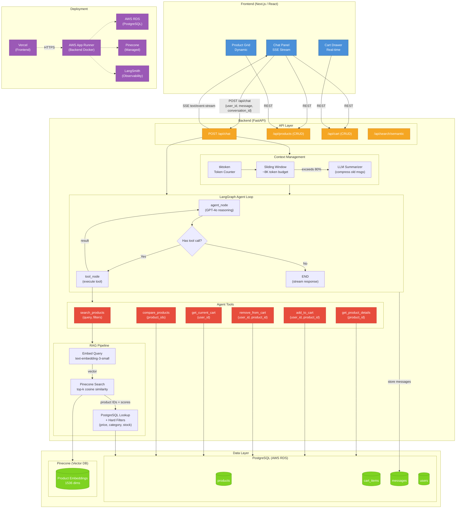

# Architecture Diagram

```mermaid
graph TB
    subgraph Frontend["Frontend (Next.js / React)"]
        CP[Chat Panel<br/>SSE Stream]
        PG[Product Grid<br/>Dynamic]
        CD[Cart Drawer<br/>Real-time]
    end

    subgraph Backend["Backend (FastAPI)"]
        direction TB

        subgraph API["API Layer"]
            ChatAPI["POST /api/chat"]
            ProductsAPI["/api/products (CRUD)"]
            CartAPI["/api/cart (CRUD)"]
            SearchAPI["/api/search/semantic"]
        end

        subgraph Agent["LangGraph Agent Loop"]
            AgentNode["agent_node<br/>(GPT-4o reasoning)"]
            Decision{Has tool call?}
            ToolNode["tool_node<br/>(execute tool)"]
            EndNode["END<br/>(stream response)"]

            AgentNode --> Decision
            Decision -->|Yes| ToolNode
            Decision -->|No| EndNode
            ToolNode -->|result| AgentNode
        end

        subgraph Tools["Agent Tools"]
            T1["search_products<br/>(query, filters)"]
            T2["get_product_details<br/>(product_id)"]
            T3["add_to_cart<br/>(user_id, product_id)"]
            T4["remove_from_cart<br/>(user_id, product_id)"]
            T5["get_current_cart<br/>(user_id)"]
            T6["compare_products<br/>(product_ids)"]
        end

        subgraph Memory["Context Management"]
            TokenCount["tiktoken<br/>Token Counter"]
            SlidingWindow["Sliding Window<br/>~8K token budget"]
            Summarizer["LLM Summarizer<br/>(compress old msgs)"]

            TokenCount --> SlidingWindow
            SlidingWindow -->|exceeds 80%| Summarizer
        end

        subgraph RAG["RAG Pipeline"]
            Embed["Embed Query<br/>text-embedding-3-small"]
            VectorSearch["Pinecone Search<br/>top-k cosine similarity"]
            SQLFilter["PostgreSQL Lookup<br/>+ Hard Filters<br/>(price, category, stock)"]

            Embed -->|vector| VectorSearch
            VectorSearch -->|"product IDs + scores"| SQLFilter
        end
    end

    subgraph DataLayer["Data Layer"]
        subgraph PG_DB["PostgreSQL (AWS RDS)"]
            Products[(products)]
            CartItems[(cart_items)]
            Messages[(messages)]
            Users[(users)]
        end
        subgraph Pinecone["Pinecone (Vector DB)"]
            Embeddings[(Product Embeddings<br/>1536 dims)]
        end
    end

    subgraph Infra["Deployment"]
        Vercel["Vercel<br/>(Frontend)"]
        AppRunner["AWS App Runner<br/>(Backend Docker)"]
        RDS["AWS RDS<br/>(PostgreSQL)"]
        PineconeCloud["Pinecone<br/>(Managed)"]
        LangSmith["LangSmith<br/>(Observability)"]
    end

    %% Frontend → Backend connections
    CP -->|"POST /api/chat<br/>{user_id, message, conversation_id}"| ChatAPI
    ChatAPI -->|"SSE text/event-stream"| CP
    CP -->|"REST"| ProductsAPI
    CP -->|"REST"| CartAPI
    PG -->|"REST"| ProductsAPI
    CD -->|"REST"| CartAPI

    %% Chat flow
    ChatAPI --> Memory
    Memory --> Agent
    ChatAPI --> Agent

    %% Agent → Tools
    ToolNode --> Tools

    %% Tools → RAG / DB
    T1 --> RAG
    T2 --> PG_DB
    T3 --> PG_DB
    T4 --> PG_DB
    T5 --> PG_DB
    T6 --> PG_DB

    %% RAG → Data
    VectorSearch --> Pinecone
    SQLFilter --> PG_DB

    %% Messages storage
    Agent -->|"store messages"| Messages

    %% Deployment connections
    Vercel -.->|"HTTPS"| AppRunner
    AppRunner -.-> RDS
    AppRunner -.-> PineconeCloud
    AppRunner -.-> LangSmith

    %% Styling
    classDef frontend fill:#4A90D9,stroke:#2C5F8A,color:#fff
    classDef backend fill:#F5A623,stroke:#C47D1A,color:#fff
    classDef db fill:#7ED321,stroke:#5A9A18,color:#fff
    classDef infra fill:#9B59B6,stroke:#7D3C98,color:#fff
    classDef tool fill:#E74C3C,stroke:#C0392B,color:#fff

    class CP,PG,CD frontend
    class ChatAPI,ProductsAPI,CartAPI,SearchAPI backend
    class Products,CartItems,Messages,Users,Embeddings db
    class Vercel,AppRunner,RDS,PineconeCloud,LangSmith infra
    class T1,T2,T3,T4,T5,T6 tool
```
